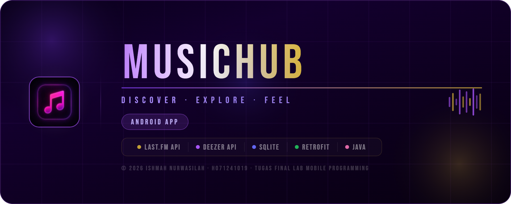
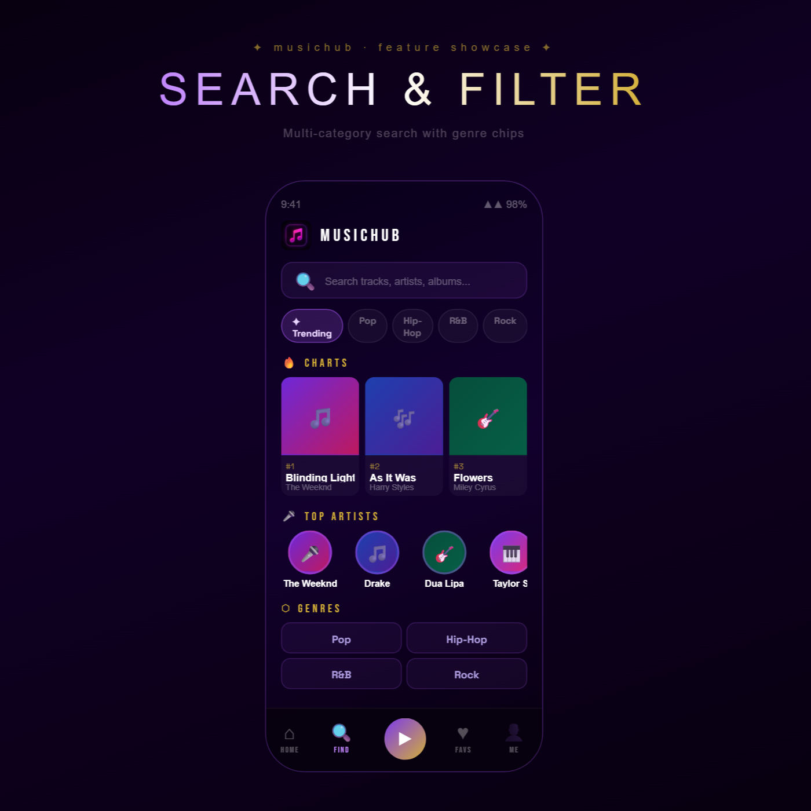
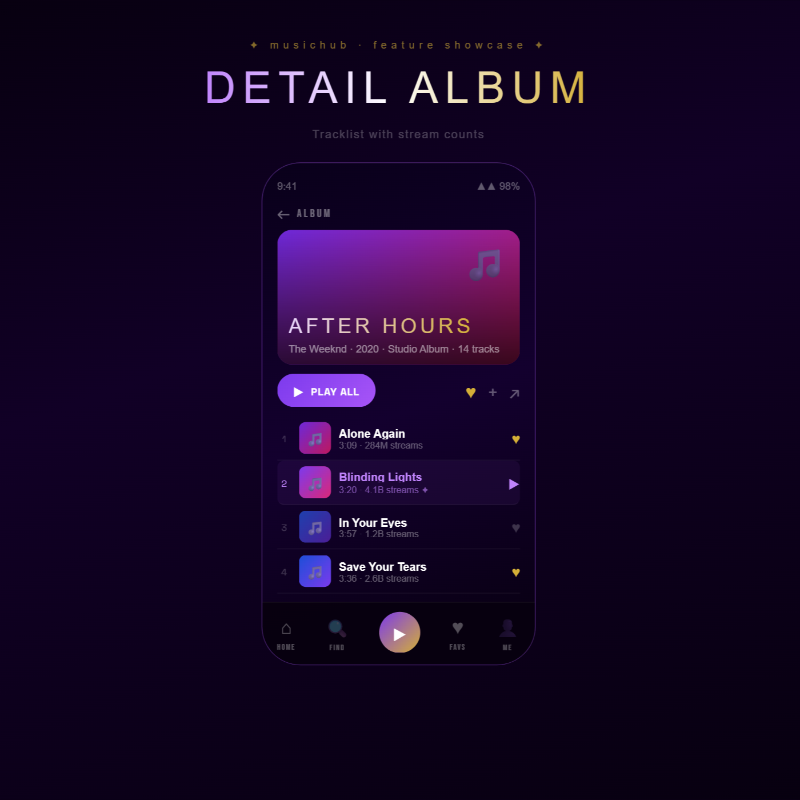
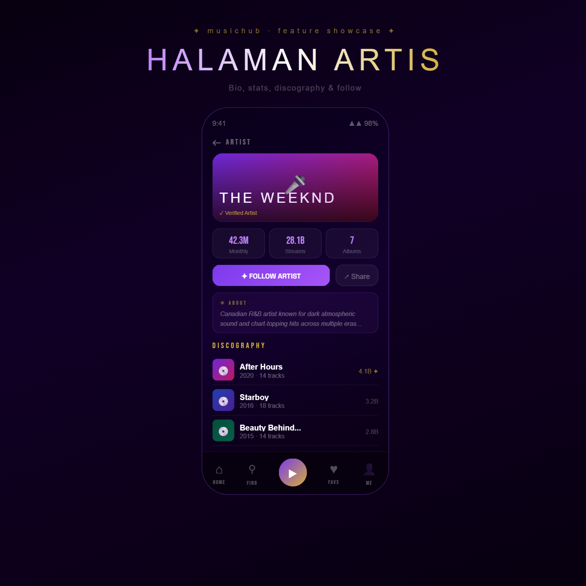
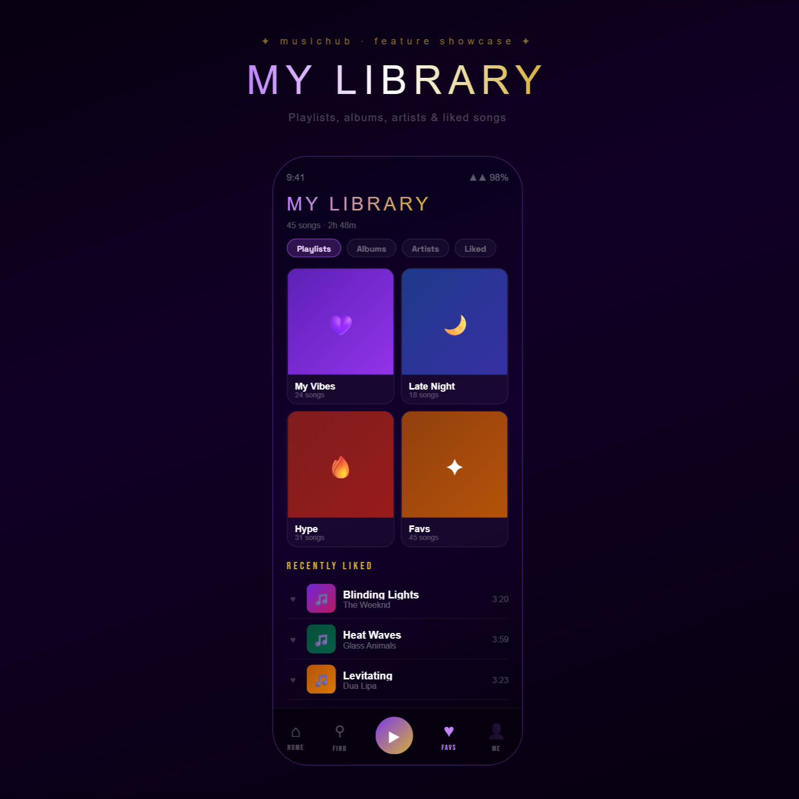
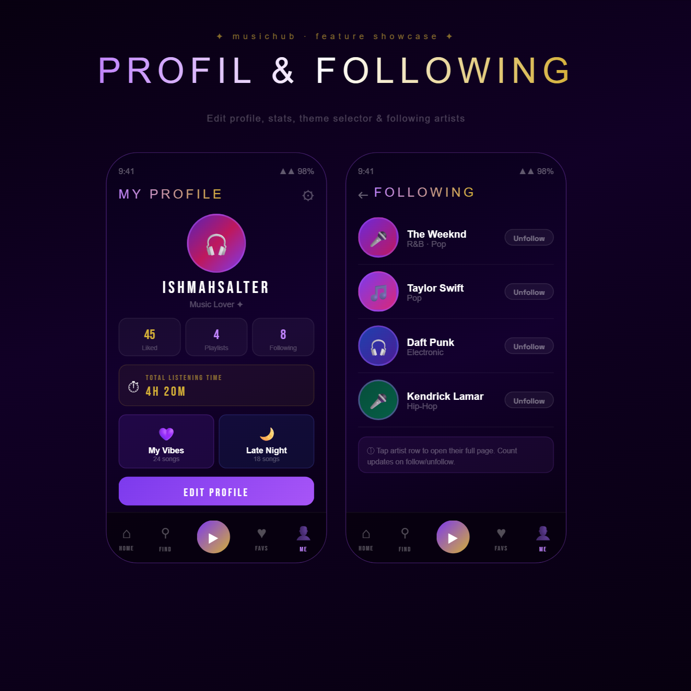
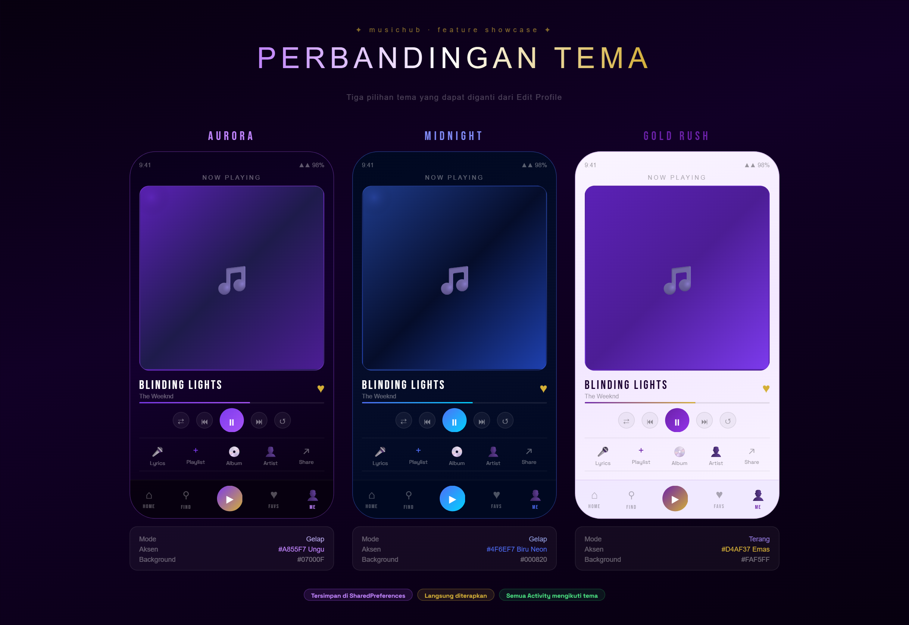
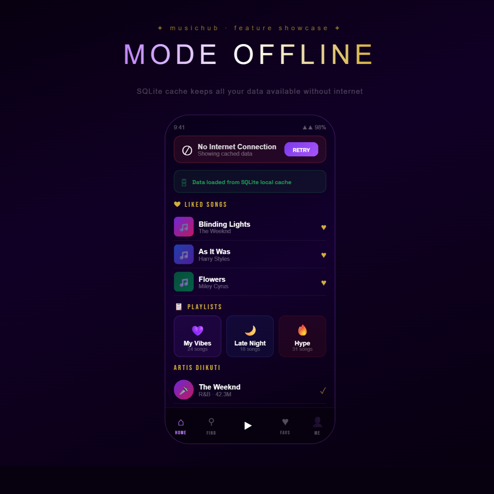

<p align="center">
  
</p>

# MusicHub

Aplikasi Android untuk eksplorasi musik yang dibangun sebagai Tugas Final Lab Mobile Programming 2026. MusicHub memungkinkan pengguna menjelajahi lagu-lagu trending, melihat diskografi artis, mengelola playlist pribadi, dan mengakses lirik tersinkronisasi — semuanya dibungkus dalam tiga pilihan tema visual yang dapat diganti langsung dari halaman profil.

---

## Daftar Isi

- [Fitur](#fitur)
- [Tema](#tema)
- [Tech Stack](#tech-stack)
- [Integrasi API](#integrasi-api)
- [Struktur Project](#struktur-project)
- [Skema Database](#skema-database)
- [Cara Menjalankan](#cara-menjalankan)
- [Cara Penggunaan](#cara-penggunaan)
- [Konvensi Commit](#konvensi-commit)
- [Catatan Implementasi Teknis](#catatan-implementasi-teknis)

---

## Fitur

**Eksplorasi Musik**

<p align="center">
  
</p>

- Menelusuri lagu trending dan chart teratas yang didukung oleh Last.fm API
- Filter genre melalui chip interaktif (Trending, Pop, Hip-Hop, R&B, Rock)
- Featured cards yang dapat digeser dengan lagu teratas minggu ini
- Pencarian multi-kategori: lagu, artis, album, dan rilis terbaru dengan auto-fokus keyboard

**Pemutaran & Lirik**

<p align="center">
  
</p>

- Layar now playing penuh dengan kontrol pemutaran (play/pause, prev, next)
- Visualizer waveform animasi saat lagu diputar
- Lirik tersinkronisasi dengan sorotan baris aktif dan fitur berbagi lirik
- Mini player persisten di bagian bawah layar selama navigasi antar tab

**Artis & Album**
- Halaman artis lengkap: foto, biografi dari Last.fm, jumlah pendengar bulanan, total stream, dan diskografi penuh
  
<p align="center">
  
</p>

- Halaman detail album dengan daftar lagu dan jumlah stream per lagu
  
<p align="center">
  
</p>

- Tombol follow/unfollow yang langsung memperbarui jumlah following di profil

**Manajemen Library**

<p align="center">
  
</p>

- Menyukai atau batal menyukai lagu, disimpan secara persisten ke SQLite lokal
- Menyimpan lagu ke satu atau beberapa playlist melalui modal bottom sheet
- Membuat, mengganti nama, dan menghapus playlist pribadi
- Mengedit cover playlist dengan preset gradien atau foto kustom dari galeri

**Profil & Following**

<p align="center">
  
</p>

- Username, bio, dan foto profil yang dapat diedit (galeri atau kamera)
- Foto profil default ditampilkan kembali secara otomatis saat foto dihapus
- Statistik profil real-time: jumlah lagu disukai, playlist, dan artis yang diikuti
- Halaman Following terpisah menampilkan semua artis yang diikuti beserta foto, genre, dan tombol Unfollow
- Foto artis diambil otomatis dari Deezer jika belum tersimpan di database, lalu disimpan kembali agar pemuatan berikutnya instan
- Mengetuk baris artis di halaman Following langsung membuka halaman artis tersebut

**Tema**

<p align="center">
  
</p>

- Tiga pilihan tema visual yang dapat diganti dari halaman Edit Profil
- Tema dipilih melalui chip interaktif dan langsung diterapkan ke seluruh aplikasi
- Tema tersimpan di SharedPreferences dan tetap aktif setelah aplikasi ditutup

**Mode Offline**

<p align="center">
  
</p>

- Lagu yang disukai, playlist, dan artis yang diikuti tetap dapat diakses tanpa internet
- Gambar dari API di-cache ke SQLite agar tidak perlu request ulang
- Tombol retry ditampilkan di semua layar saat koneksi tidak tersedia

---

## Tema

MusicHub hadir dengan tiga tema visual yang dapat dipilih langsung dari layar Edit Profil. Masing-masing tema memiliki palet warna, aksen, dan nuansa yang berbeda.
<p align="center">
  
</p>

---

### Aurora

Tema gelap dengan aksen ungu elektrik. Cocok untuk penggunaan malam hari dengan kontras tinggi dan tampilan futuristik.

| | |
|---|---|
| **Mode** | Gelap |
| **Warna aksen** | Ungu — `#A855F7` |
| **Latar belakang** | Hitam gelap dengan nuansa ungu |
| **Cocok untuk** | Penggunaan di lingkungan minim cahaya |

---

### Midnight

Tema gelap dengan aksen biru neon yang intens. Memberikan kesan futuristik dan tegas, berbeda dari Aurora meskipun sama-sama mode gelap.

| | |
|---|---|
| **Mode** | Gelap |
| **Warna aksen** | Biru neon — `#4F6EF7` |
| **Latar belakang** | Hitam gelap dengan nuansa biru |
| **Cocok untuk** | Pengguna yang menyukai aksen dingin dan biru |

---

### Gold Rush

Tema terang dengan aksen emas dan ungu. Tampilan siang hari yang elegan dengan nuansa mewah.

| | |
|---|---|
| **Mode** | Terang |
| **Warna aksen** | Emas `#D4AF37` dan ungu `#6B21A8` |
| **Latar belakang** | Putih keunguan yang terang |
| **Cocok untuk** | Penggunaan di siang hari atau di luar ruangan |

---

## Tech Stack

| Lapisan | Teknologi |
|---|---|
| Bahasa | Java |
| Minimum SDK | API 24 (Android 7.0) |
| Komponen UI | RecyclerView, ViewPager2, Navigation Component, CardView, CircleImageView |
| Networking | Retrofit 2 + Gson |
| Pemuatan Gambar | Glide (dengan `DiskCacheStrategy.ALL`) |
| Penyimpanan Lokal | SQLite (DatabaseHelper manual + pola DAO) |
| Preferensi | SharedPreferences |
| Threading | ExecutorService, Handler + Looper |
| Pemilih Gambar | ActivityResultLauncher (galeri dan kamera) |

---

## Integrasi API

MusicHub menggunakan dua API publik secara kombinasi: Last.fm untuk metadata musik dan Deezer untuk gambar resolusi tinggi.

### Last.fm API
Membutuhkan API key gratis dari [last.fm/api](https://www.last.fm/api).

| Endpoint | Kegunaan |
|---|---|
| `chart.getTopTracks` | Lagu trending di layar Home |
| `tag.getTopTracks` | Daftar lagu berdasarkan filter genre |
| `track.search` | Fitur pencarian lagu |
| `track.getInfo` | Detail dan metadata lagu |
| `artist.getInfo` | Biografi artis dan statistik pendengar |
| `artist.getTopAlbums` | Daftar diskografi artis |
| `album.getInfo` | Daftar lagu dalam album |
| `chart.getTopArtists` | Artis teratas di halaman pencarian |

### Deezer API
Tidak membutuhkan API key. Digunakan khusus untuk aset gambar beresolusi tinggi.

| Endpoint | Kegunaan |
|---|---|
| `GET /search/track?q={query}` | Cover album (`album.cover_xl`) |
| `GET /search/artist?q={name}` | Foto artis (`picture_xl`) |

### Cara Kerja Kombinasi

Saat memuat lagu atau artis, aplikasi pertama-tama mengambil metadata dari Last.fm, kemudian mengirimkan request kedua ke Deezer untuk mendapatkan URL gambar resolusi tinggi. Kedua hasil digabungkan di memori dan URL gambar di-cache ke tabel `cached_images` agar tidak perlu request ulang pada pemuatan berikutnya.

Untuk artis yang diikuti, jika `artist_photo` di database masih kosong, FollowingActivity secara otomatis mengambil foto dari Deezer saat layar dibuka (panggilan sinkron di background thread) dan menyimpannya kembali ke SQLite via `ArtistDao.updateArtistPhoto()`.

---

## Struktur Project

```
com.ishmah.musichub/
├── activity/
│   ├── SplashActivity.java          -- Launcher dengan animasi progress bar
│   ├── MainActivity.java            -- Host Fragment dengan Bottom Navigation
│   ├── DetailActivity.java          -- Layar now playing penuh
│   ├── ArtistActivity.java          -- Halaman artis dengan diskografi dan follow
│   ├── AlbumActivity.java           -- Detail album dengan daftar lagu
│   ├── LyricsActivity.java          -- Tampilan lirik tersinkronisasi
│   ├── PlaylistDetailActivity.java  -- Tampilan dan manajemen playlist
│   ├── EditProfileActivity.java     -- Pengeditan profil dan pilihan tema
│   └── FollowingActivity.java       -- Daftar artis yang diikuti
├── fragment/
│   ├── HomeFragment.java            -- Lagu trending dan featured cards
│   ├── SearchFragment.java          -- Pencarian multi-kategori
│   ├── FavoriteFragment.java        -- Lagu disukai dan playlist
│   └── ProfileFragment.java         -- Ringkasan profil pengguna
├── adapter/
│   ├── TrackAdapter.java
│   ├── AlbumAdapter.java
│   ├── PlaylistCardAdapter.java
│   ├── PlaylistTrackAdapter.java
│   ├── FeaturedCardAdapter.java
│   └── FollowingArtistAdapter.java
├── api/
│   ├── LastFmApi.java               -- Interface Retrofit untuk Last.fm
│   ├── DeezerApi.java               -- Interface Retrofit untuk Deezer
│   ├── RetrofitClient.java          -- Builder instance Retrofit
│   ├── ApiConfig.java               -- API key dan konstanta
│   └── NetworkChecker.java          -- Deteksi konektivitas jaringan
├── db/
│   ├── DatabaseHelper.java          -- SQLiteOpenHelper, pembuatan skema
│   ├── FavoriteDao.java
│   ├── PlaylistDao.java
│   ├── ArtistDao.java
│   ├── UserProfileDao.java
│   └── CachedImageDao.java
├── model/
│   ├── Track.java
│   ├── FeaturedCard.java
│   └── (model lainnya)
├── ThemeHelper.java                 -- Penerapan tema ke Activity
└── MusicPlayerManager.java          -- Singleton pengelola pemutaran audio
```

---

## Skema Database

### `favorites`
| Kolom | Tipe | Keterangan |
|---|---|---|
| trackId | TEXT PRIMARY KEY | |
| name | TEXT | Nama lagu |
| artist | TEXT | |
| albumArt | TEXT | URL cover dari Deezer |
| duration | TEXT | Format `m:ss` |

### `playlists`
| Kolom | Tipe | Keterangan |
|---|---|---|
| playlist_id | INTEGER PRIMARY KEY | Autoincrement |
| playlist_name | TEXT | |
| cover_type | TEXT | `gradient` atau `uri` |
| cover_value | TEXT | Kunci gradien atau path file |
| created_at | TEXT | Timestamp pembuatan |

### `playlist_tracks`
| Kolom | Tipe | Keterangan |
|---|---|---|
| id | INTEGER PRIMARY KEY | Autoincrement |
| playlist_id | INTEGER | Foreign key ke `playlists` |
| track_id | TEXT | |

### `following_artists`
| Kolom | Tipe | Keterangan |
|---|---|---|
| artist_id | TEXT PRIMARY KEY | |
| artist_name | TEXT | |
| artist_photo | TEXT | URL `picture_xl` dari Deezer |
| genre | TEXT | |
| followed_at | TEXT | Unix timestamp saat follow |

### `user_profile`
| Kolom | Tipe | Keterangan |
|---|---|---|
| username | TEXT | |
| bio | TEXT | |
| photo_uri | TEXT | URI file lokal (galeri atau kamera) |
| theme | TEXT | `dark` atau `light` |
| notif_enabled | INTEGER | `0` atau `1` |
| total_listening_seconds | INTEGER | Akumulasi waktu mendengarkan |

### `cached_images`
| Kolom | Tipe | Keterangan |
|---|---|---|
| query_key | TEXT PRIMARY KEY | `namaLagu_namaArtis` |
| cover_url | TEXT | URL cover album dari Deezer |
| artist_photo | TEXT | URL foto artis dari Deezer |
| cached_at | TEXT | Timestamp cache |

---

## Cara Menjalankan

### Prasyarat

- Android Studio Hedgehog atau lebih baru
- Perangkat Android atau emulator dengan API 24 ke atas
- API key Last.fm gratis dari [last.fm/api](https://www.last.fm/api)

### Langkah Instalasi

1. Clone repository:
```bash
git clone https://github.com/ishmahsalter/MusicHub.git
cd MusicHub
```

2. Buka project di Android Studio.

3. Tambahkan API key Last.fm di `app/src/main/java/com/ishmah/musichub/api/ApiConfig.java`:
```java
public static final String LASTFM_API_KEY = "masukkan_api_key_disini";
```

4. Sync Gradle lalu jalankan project di perangkat atau emulator.

---

## Cara Penggunaan

**Menelusuri Musik**
Buka aplikasi dan layar Home memuat lagu trending secara otomatis. Ketuk chip genre untuk memfilter berdasarkan kategori. Geser featured card untuk melihat lagu teratas minggu ini. Ketuk lagu mana pun untuk membuka layar Now Playing.

**Now Playing**
Dari layar Now Playing, gunakan tombol aksi untuk melihat lirik tersinkronisasi, menyimpan lagu ke playlist, membuka halaman album, atau mengunjungi halaman artis.

**Mencari**
Ketuk search bar di layar Home untuk langsung membuka halaman Search dengan keyboard otomatis terbuka. Cari lagu, artis, album, atau rilis terbaru.

**Halaman Artis**
Menampilkan foto artis, biografi, jumlah pendengar bulanan, total stream, dan diskografi. Ketuk Follow untuk menambahkan artis ke daftar following — jumlah di profil langsung diperbarui.

**Following**
Ketuk angka Following di halaman Profil untuk membuka layar daftar artis yang diikuti. Setiap baris menampilkan foto artis (diambil otomatis dari Deezer jika belum ada), nama, genre, dan tombol Unfollow. Ketuk baris artis untuk membuka kembali halaman artis tersebut.

**Library**
Tab Favorit menampilkan semua lagu yang disukai dan playlist pribadi dari SQLite lokal. Bagian ini berfungsi penuh secara offline.

**Profil & Tema**
Ketuk ikon edit atau tombol Edit Profile untuk mengubah username, bio, foto profil, serta memilih tema. Tiga pilihan tersedia: **Aurora** (gelap ungu), **Midnight** (gelap biru), dan **Gold Rush** (terang emas). Perubahan tema langsung diterapkan ke seluruh aplikasi.

**Mode Offline**
Saat tidak ada koneksi internet, semua layar yang bergantung pada API menampilkan tombol Retry. Data favorit, playlist, dan artis yang diikuti tetap tampil dari SQLite lokal.

---

## Konvensi Commit

Project ini mengikuti format commit yang konsisten:

| Prefix | Kegunaan |
|---|---|
| `feat:` | Fitur baru atau layar baru |
| `fix:` | Perbaikan bug |
| `refactor:` | Restrukturisasi kode tanpa perubahan perilaku |
| `style:` | Perubahan UI atau layout |
| `docs:` | Pembaruan dokumentasi |
| `chore:` | Konfigurasi build, dependensi, setup project |

---

## Catatan Implementasi Teknis

**Background Threading**
Semua operasi baca dan tulis SQLite dijalankan di `ExecutorService` yang didedikasikan melalui lapisan DAO agar tidak memblokir main thread. Hasil dikembalikan ke UI melalui `Handler(Looper.getMainLooper())`.

**Pipeline Gambar**
Gambar diambil dari Deezer secara paralel menggunakan pool `ExecutorService` 4 thread di HomeFragment. URL disimpan ke tabel `cached_images`. Glide digunakan dengan `DiskCacheStrategy.ALL` untuk cache memori dan disk. Untuk artis yang diikuti dengan foto kosong di database, FollowingActivity mengambil foto via `deezerApi.searchArtist().execute()` (sinkron di background thread) lalu memperbarui baris di SQLite melalui `ArtistDao.updateArtistPhoto()`.

**Sistem Tema**
Tiga tema diimplementasikan dengan strategi berbeda:
- **Aurora** — `DayNight` dengan `values-night/themes.xml`, aksen ungu `#A855F7`
- **Gold Rush** — `DayNight` dengan `values/themes.xml` (mode terang), aksen emas dan ungu
- **Midnight** — `setTheme(R.style.Theme_MusicHub_Midnight)` secara eksplisit, aksen biru `#4F6EF7`

Semua warna aksen menggunakan `?attr/colorPrimary` atau custom attribute seperti `?attr/chipActiveFill` dan `?attr/waveformBarColor` agar setiap tema dapat menimpa warna secara konsisten tanpa mereferensikan `@color/` yang tidak mengikuti `setTheme()`.

**Navigasi**
Empat Fragment tingkat atas dikelola oleh Navigation Component via satu `nav_graph.xml`. Activity tambahan (Detail, Artist, Album, Lyrics, Following) diluncurkan via Intent eksplisit. Search bar di HomeFragment memanggil `MainActivity.openSearch()` secara langsung untuk memastikan bottom nav tab ikut aktif.

**Following & Foto Artis**
Saat pengguna menekan Follow di ArtistActivity, jika URL foto belum tersedia (Deezer fetch belum selesai), aplikasi memicu fetch ulang terlebih dahulu lalu menyimpan hasilnya ke `following_artists` setelah foto berhasil diperoleh. Ini memastikan foto selalu tersimpan dengan benar di database dari awal.

---

*Tugas Final Lab Mobile 2026 — Ishmah Nurwasilah*
